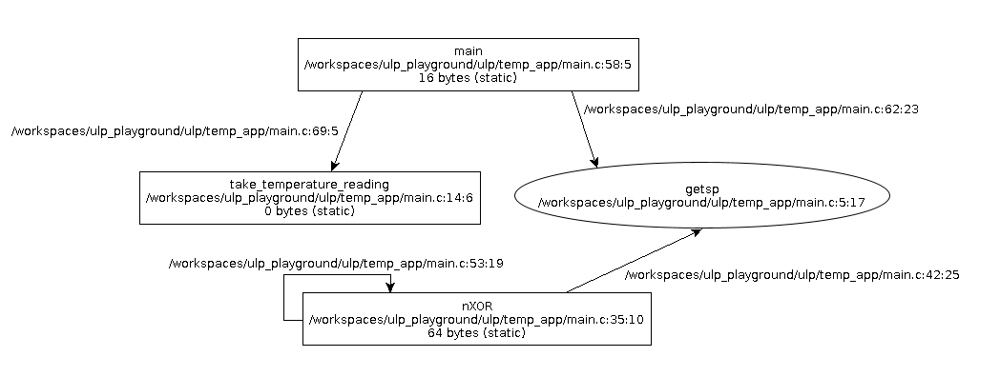

# Lesson 12 - Static Analysis: Stack Usage and Call Graphs

## What We'll Cover
- What is static analysis
- Modifying compiler options for ULP application
- Generating static analysis of stack usage
- Generating a call graph with stack usage
- Early warning notification of stack troubles

To see all of the changes made and working simply run `git checkout lesson-12-end`. 

To follow along, run `git checkout lesson-12` and follow the instructions below.

## What is Static Analysis

One of my favorite sayings is "The compiler is one of your best programmers." I love compiled 
languages because they eliminate an entire class of bugs. The compiler prevents you from running code 
that simply won't work because it refuses to build it. It also takes your 💩 code and optimizes it 
for the architecture it will run on. 

> [!TIP]
> Unrelated to this series is another saying I have. "You're not smarter than the compiler". Don't try 
> to outwit it. Bad things will happen. That's a free tip.

In addition to these helpful things, the compiler can do some other extremely helpful things for us like 
static analysis. Static analysis is the analysis of our application without actually running it. The 
compiler is smart enough to analyze our code and tell us some things that may not be obvious to us 
just by looking at the code. Two examples of this are stack usage and call graphs.

If you recall from Lessons 7 and 8, one thing of paramount concern to us in our ULP application is 
stack usage. We need to deeply understand our stack usage so we know how much memory we need to 
accommodate it. Well, the compiler can't give us all the answers but it can help.

## Modifying Compiler Options

Now that our ULP application is it's own project with it's own **CMakeLists.txt** file, we can modify 
the compiler options. This is not possible using the simpler `ulp_embed_binary` approach we started 
with. If you take a look at [this GCC doc page](https://gcc.gnu.org/onlinedocs/gcc/RISC-V-Options.html) 
you can see there are a lot of RISC-V compiler options we can modify (not all of them will apply 
to our ESP32 environment). We can also modify generic compiler options as we'll see below.

To modify a compiler option for our ULP application we simply add it in our 
**ulp/temp_app/CMakeLists.txt** in the call to `target_compile_options`.

## Generating Stack Analysis Files
The compiler is able to look at our code and give us some idea of what our stack usage will be. It 
can't give us a single max number but it can tell use how much each function will use. By default it 
doesn't output that information but we can tell it to with the `-fstack-usage` option. Modify the 
call to `target_compile_options` in the ULP 
**CMakeLists.txt** file to be the following.

```cmake
target_compile_options(${ULP_APP_NAME} PRIVATE -fstack-usage)
```

Now let's re-build the project.

```sh
idf.py build
```

That was uneventful. It just looked like a normal build. Well, it was, but it created a few extra gold nuggets for us. We just have to find them. Let's do a search.

```sh
find ./build -name *.su
```

This does a search for stack usage files generated by the compiler. It should find 10 or so files with 
that extension. Let's open up the one called **main.c.su**.

```txt
/workspaces/ulp_playground/ulp/temp_app/main.c:14:6:take_temperature_reading	0	static
/workspaces/ulp_playground/ulp/temp_app/main.c:35:10:nXOR	64	static
/workspaces/ulp_playground/ulp/temp_app/main.c:58:5:main	16	static
```

We can see that `take_temperature_reading` uses 0 bytes on the stack, `nXOR` uses 64 and `main` uses 
16. We know all of these numbers because we measured them with our stack monitoring code. However, 
it's so much nicer to know, at compile time, what those numbers are. You can look through every 
**.su** file to see how other compiled library code affects the stack as well. 

The `static` keyword indicates the stack frame size is known and deterministic. If it were to say 
`dynamic` that means it can't determine at compile-time a deterministic value. If you ever see 
`dynamic` it means you need to refactor your ULP code because it means your function doesn't have a 
deterministic stack frame size. The exception to this is if it says `dynamic bounded`. The `bounded` 
keyword means the size reported is a reliable maximum and you should plan for it.

It's important to understand that these analysis files can't tell you how the stack sizes will combine. 
They simply tell you how much each function will use. It's up to you to understand your call graph or, 
as we illustrated earlier, recursion issues. 

## Building the Call Graph

Since we mentioned the call graph, let's add another compiler option to get that information as well. 
To do this we can take advantage of `-fcallgraph-info=su`. The option by itself will 
generate a **.ci** file with call graph information. Adding the `=su` causes it to include the same 
stack usage information from our **.su** file.

Modify the `target_compile_options` line in the ULP **CMakeLists.txt** file to be the following.

```cmake
target_compile_options(${ULP_APP_NAME} PRIVATE -fstack-usage -fcallgraph-info=su)
```

Let's build again with `idf.py build`. Now, next to our **.su** file in the build output we now 
have a **main.c.ci** file which looks like this.

```txt
graph: { title: "/workspaces/ulp_playground/ulp/temp_app/main.c"
node: { title: "take_temperature_reading" label: "take_temperature_reading\n/workspaces/ulp_playground/ulp/temp_app/main.c:14:6\n0 bytes (static)" }
node: { title: "nXOR" label: "nXOR\n/workspaces/ulp_playground/ulp/temp_app/main.c:35:10\n64 bytes (static)" }
node: { title: "getsp" label: "getsp\n/workspaces/ulp_playground/ulp/temp_app/main.c:5:17" shape : ellipse }
edge: { sourcename: "nXOR" targetname: "getsp" label: "/workspaces/ulp_playground/ulp/temp_app/main.c:42:25" }
edge: { sourcename: "nXOR" targetname: "nXOR" label: "/workspaces/ulp_playground/ulp/temp_app/main.c:53:19" }
node: { title: "main" label: "main\n/workspaces/ulp_playground/ulp/temp_app/main.c:58:5\n16 bytes (static)" }
edge: { sourcename: "main" targetname: "getsp" label: "/workspaces/ulp_playground/ulp/temp_app/main.c:62:23" }
edge: { sourcename: "main" targetname: "take_temperature_reading" label: "/workspaces/ulp_playground/ulp/temp_app/main.c:69:5" }
}
```

This file is in the VCG format and can be used to graph our call graph. I'll leave that as an 
exercise between you and Google. Spoiler, it was more complicated than I expected. Ultimately I 
used [yComp](https://pp.ipd.kit.edu/firm/yComp.html) and was able to produce the following graph 
from that output file.



It shows all of our functions along with their stack usage. This is pretty cool. All thanks to our 
favorite programmer Captain Compiler. You'll notice it includes the `nXOR` function even though it 
currently gets optimized out because nothing calls it. But we can see it's a recursive function 
because it has an arrow that points back to itself. Every edge has the line number in source of where 
the call to another function is made. We also see that `getsp` looks a bit different because it's 
an assembly call, not a normal C function. This is great stuff! 

## Stack Size Warning

One final compiler flag tool I want to include is `-Wstack-usage=[size]`. This is a simple way to 
immediately detect, at compile time, if any function exceeds a certain stack size. Currently the 
`nXOR` function has a 64 byte stack size but let's assume, as a general rule, we don't want any of 
our functions to exceed 32 bytes for the stack frame. All we have to do is add another compiler flag.

```cmake
target_compile_options(${ULP_APP_NAME} PRIVATE -fstack-usage -fcallgraph-info=su -Wstack-usage=32)
```

Now, when we build our app we get a warning.

```txt
/workspaces/ulp_playground/ulp/temp_app/main.c:35:10: warning: stack usage is 64 bytes [-Wstack-usage=]
   35 | uint32_t nXOR(int n)
```

But it still builds. What if we want it to be a mandate, not a suggestion. There's a compiler option 
for that too. We simply change our warning to an error with the following syntax.

```cmake
target_compile_options(${ULP_APP_NAME} PRIVATE -fstack-usage -fcallgraph-info=su -Werror=stack-usage=32)
```

Now when we build we see the following:

```txt
/workspaces/ulp_playground/ulp/temp_app/main.c:35:10: error: stack usage is 64 bytes [-Werror=stack-usage=]
   35 | uint32_t nXOR(int n)
      |          ^~~~
cc1: some warnings being treated as errors
```

In this case, the ULP app won't successfully compile.

Hopefully you are starting to see how beneficial the compiler can be in helping us write better code. 
Armed with all of this new information you can detect potential issues in your code and fix them before 
they become catastrophic bugs in production.