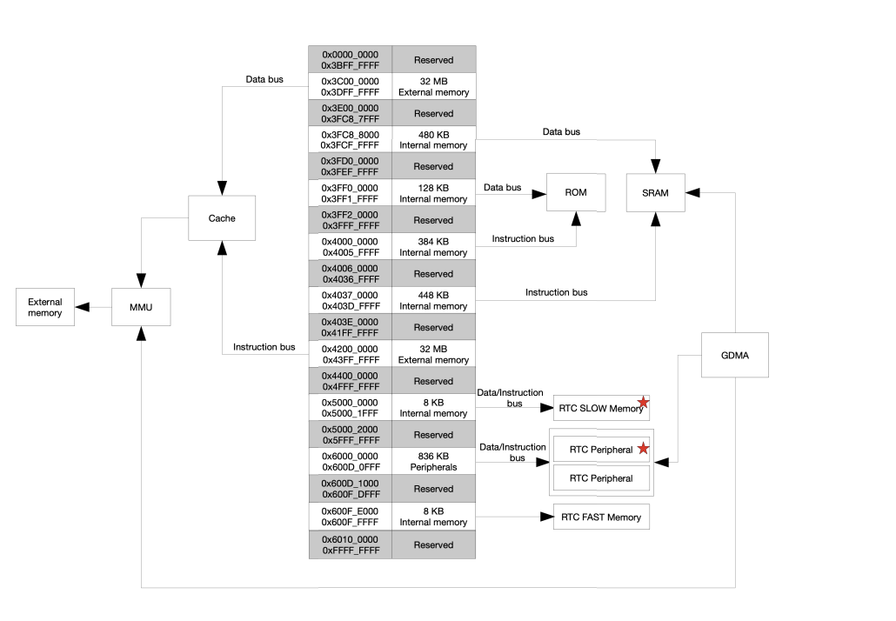

# Lesson 4 - Under the Hood

## What We'll Cover
- What processor architecture is used
- How your ULP application compiled
- Where is your ULP application stored
- How is your ULP application structured
- How to inspect your ULP application layout

There isn't really an "end" to this lesson code-wise. We'll mostly be poking around the build system 
and looking at build output. 

To follow along, run `git checkout lesson-4` and follow the instructions below.

> [!IMPORTANT]
> I strongly encourage you not to skip this lesson. Yes, it's kind of boring. Yes, it's nitty gritty 
> details. The exact kind of details you will need when your ULP application goes bad. And trust me, 
> it will go bad at some point. 

This lesson gives you a set of knowledge tools to help you diagnose and fix those problems. So don't 
skip it. Each section will cover a different aspect of how the ULP works, under the hood. A lot of this 
is just general low-level computing stuff but it's fun to see unfold before you. At the end of each 
section I provide a reminder of the practical use of what you just learned.

Future lessons will use all of the concepts covered in this lesson. 

## ULP RISC-V Processor Architecture

First of all, it's pronounced "risk five".

We keep saying that we are using the RISC-V co-processor to run our ULP app but what does that mean? 
There are tons of tutorials on RISC-V but for the purpose of writing ULP applications all you need to 
know is that it's an ISA (instruction set architecture) that defines a list of instructions a supported 
CPU must know how to executue. Other common architectures you've probably heard of are MIPS, ARM and x86.

That means, when your C code is compiled, it is compiled and linked into a set of RISC-V instructions 
which the ULP processor knows how to execute.

RISC-V is a HUGE specification with tons of extensions and details. However, the Espressif 
documentation states:

> The RISC-V processor is a 32-bit fixed point machine. Its instruction set is based on **RV32IMC** which includes hardware multiplication and division, and compressed code.

### Practical Use

Why do I care? I'm writing C code. That's mostly true. However, if you get to a point where you 
absolutely must write some assembly (which we will do in a later lesson) you now know what parts of the 
RISC-V ecosystem are at your disposal. Specifically, RV32IMC. This can help guide you through the docs 
to know whether a specific instruction or extension is available on the ULP co-processor.

## Compilation Process
In lesson 2 we set up everything so our ULP application would be compiled, linked, and added to our 
project but it was a lot of boilerplate copy and paste. What is actually happening under the hood?

To answer this we actually have to _go_ under the hood. I think it's helpful to show the process of 
figuring this out as it will apply to other areas of the build system. Let me show you a simple way to 
go about digging this information up.

We know, from our prior CMakeLists.txt modifications that part of the secret ULP sauce is this:

```txt
ulp_embed_binary(${ulp_app_name} "${ulp_riscv_sources}" "${ulp_exp_dep_srcs}")
```

We're calling a CMake function `ulp_embed_binary`. Just like any other source code, this function has a 
definition somewhere. We can search for it in a couple of ways. The easiest is just searching the 
repository on Github for "ulp_embed_binary". You can also easily search in your VSCode dev container 
terminal with the command:

```sh
grep -rnw ~/esp/idf/ -e "function(ulp_embed_binary"
```
Which outputs:
```sh
/home/dev/esp/idf/components/ulp/project_include.cmake:94:function(ulp_embed_binary app_name s_sources exp_dep_srcs)
```
It's even clickable right from the terminal window which will open the file in a tab. Just Ctrl-click it.

Even if you're not familiar with the CMake syntax you can start to browse through the code to get a 
sense of what's happening. The section mentioning `TOOLCHAIN_FLAG` seems important because we know we 
need a "toolchain" to build an executable. Again, no magic here. We're just trying to piece together 
some basic knowledge we have about compiled languages.

We see, in that section (lines 41-52 at time of writing), it does some if/else selection based on the target. 
We're using an ESP32-S3 and the RISC-V co-processor so this seems to be what we're looking for:

```cmake
elseif(IDF_TARGET STREQUAL "esp32s2" OR IDF_TARGET STREQUAL "esp32s3")
    if(CONFIG_ULP_COPROC_TYPE_RISCV STREQUAL "y")
        set(TOOLCHAIN_FLAG ${idf_path}/components/ulp/cmake/toolchain-ulp-riscv.cmake)
```

So let's open that file. And......JACKPOT!

```cmake
# CMake toolchain file for ULP-RISC-V
set(CMAKE_SYSTEM_NAME Generic)

set(CMAKE_C_COMPILER "riscv32-esp-elf-gcc")
set(CMAKE_CXX_COMPILER "riscv32-esp-elf-g++")
set(CMAKE_ASM_COMPILER "riscv32-esp-elf-gcc")

set(CMAKE_C_FLAGS "-Os -march=rv32imc_zicsr_zifencei -mdiv -fdata-sections -ffunction-sections"
    CACHE STRING "C Compiler Base Flags")
set(CMAKE_CXX_FLAGS "-Os -march=rv32imc_zicsr_zifencei -mdiv -fdata-sections -ffunction-sections"
    CACHE STRING "C++ Compiler Base Flags")
set(CMAKE_ASM_FLAGS "-march=rv32imc -x assembler-with-cpp"
    CACHE STRING "Assembler Base Flags")
set(CMAKE_EXE_LINKER_FLAGS "-march=rv32imc_zicsr_zifencei --specs=nano.specs --specs=nosys.specs"
    CACHE STRING "Linker Base Flags")
```

We can see the our ULP source files will be compiled with **riscv32-esp-elf-gcc** and will have the 
following flags passed: `-Os -march=rv32imc_zicsr_zifencei -mdiv -fdata-sections -ffunction-sections`. 
Not sure what all of those mean? No problem. You can Google them and gain more knowledge. Or, I asked 
Claude AI to explain them to me and got a very verbose explanation for each. Here is an especially 
helpful explanation of our architecture flag.

```txt
-march=rv32imc_zicsr_zifencei: This is a RISC-V architecture specification flag that indicates:

rv32: 32-bit RISC-V architecture
i: Base integer instruction set
m: Integer multiplication and division instructions
c: Compressed instruction set (16-bit instructions)
zicsr: Control and Status Register (CSR) instructions
zifencei: Instruction-fetch fence instructions
```
Remember that RV32IMC note from above? Now you understand a bit better what exactly that means. The 
file also shows us the flags passed to the linker for our ULP app. All of this may seem like low level 
detail you don't care about but, I promise, there is incredible power in knowing these things.

> [!CAUTION]
> AI is a powerful tool, especially when you ask it to explain coding concepts to you. That said, it can 
> also lie to your face with extreme confidence. Always take AI responses with a grain of salt and 
> verify accuracy. Everything has a truth of source in this problem space. AI can be a shortcut to that 
> info.

### Practical Use
Now that you know exactly how the ULP app is compiled, you have insight into what the compiler is doing and 
can even make changes by altering/adding command line arguments. We're going to try using this to 
our advantage later.

### Where Is Your App Stored on the ESP32?
In Lesson 2 we learned about the .S file generated by the compiler which contains your ULP application 
code. We also learned that the application had to be loaded at runtime and is not flashed to it's final 
destination when the rest of your ESP32 application is flashed. It's not like the ESP32 asks you to 
insert a floppy disk to load your ULP app. So where is it?

If you don't have a current build of your application, run `idf.py build`. In the **build** folder there 
is a file named **ulp_playground.map**. As the name suggests, it's a map of your _main_ ESP32 
application (not your ULP app). The **build/ulp_playground.bin** file is what gets flashed onto your 
ESP32 dev board and the map file tells us a lot about how that binary is structured.

Open the **ulp_playground.map** file and search for "_binary_ulp_main_bin_start". It will appear several times, but the occurance of interest is in this section of the map file.

```txt
 .rodata.embedded
    0x3c0289ec       0x84 esp-idf/main/libmain.a(ulp_main.bin.S.obj)
    0x3c0289ec                _binary_ulp_main_bin_start
    0x3c0289ec                ulp_main_bin
    0x3c028a6c                _binary_ulp_main_bin_end
    0x3c028a6c                ulp_main_bin_length
```
The map file is telling you where, in the main ESP32 executable, it has embedded your ULP application. 
When you run `idf.py flash monitor` your ULP code is added to the flash of the ESP32. You can think of 
it as a file within the main app. Instead of opening it or browsing to it, you reference it by it's symbol 
name `_binary_ulp_main_bin_start` to tell ESP-IDF where it is so it can load it at runtime.

### Practical Use
Now that you know the ULP app is just a loaded set of instructions I have a question? What if you want 
to have more than one ULP program? Maybe your product has different modes or feature sets depending on a 
hardware SKU. Can you do that?

Of course you can. You simply compile, link, and embed multiple ULP applications into your main 
application binary and then you can choose, at runtime, which one to load and when. You can only run one 
at a time, of course, but this is still a powerful concept that you might use. The ESP32 has a lot of 
Flash space where you can store multiple ULP "files" to be loaded at your discretion. 

## Memory Layout


I wanted to include this to help you have a mental map of the memory layout in your ESP32. This is Figure 4.2-1 from the [ESP32-S3 Technical Manual](https://www.espressif.com/sites/default/files/documentation/esp32-s3_technical_reference_manual_en.pd). 

When you execute `ulp_riscv_load_binary` from your main application, ESP-IDF code copies your ULP 
application from Flash to the RTC SLOW Memory region shown in this figure. You can see that it has a 
memory address from 0x500000000 to 0x500001FFFF which is 8KB. 

Your ULP application can access the two memory regions marked with a red star.

> [!IMPORTANT]
> Any variables you store in RTC SLOW Memory from your main application also go into this 
> same RTC SLOW Memory region. This is a balancing act, espectially if you are trying to store 
> large arrays that will persist across soft resets. If you set the ULP reserved memory to 8KB you 
> will not be able to have any variables in your main application marked as `RTC_NOINIT_ATTR`.

### Practical Use
Knowing that your ULP application shares the same memory region as your application code variables that 
need to persist across deep sleep will help you balance those allocations.

## ULP Application Structure
The ULP application has a structure that is very similar to most compiled binaries. It has different memory sections that are populated with mostly-relocatable code. But to make that more concrete we can look at the linker file for our ULP app. It's standard, and provided by ESP-IDF. Unfortunately, you have to dig for it a bit. But, trust me, it's worth the effort.

Let's use the `find` command. Make sure your project is built. From the root of the repo run:
```sh
find ./build/esp-idf -name ulp_riscv.ld
```

Again, you can Ctrl-click on the result to open it in VSCode.

```txt
ENTRY(reset_vector)
MEMORY
{
    ram(RW) : ORIGIN = 0, LENGTH = 4096
}
SECTIONS
{
    . = ORIGIN(ram);
    .text :
    {
        *ulp_riscv_vectors.S.obj(.text.vectors)
        *(.text)
        *(.text*)
    } >ram
    .rodata ALIGN(4):
    {
        *(.rodata)
        *(.rodata*)
    } > ram
    .data ALIGN(4):
    {
        *(.data)
        *(.data*)
        *(.sdata)
        *(.sdata*)
    } > ram
    .bss ALIGN(4) :
    {
        *(.bss)
        *(.bss*)
        *(.sbss)
        *(.sbss*)
    } >ram
    __stack_top = ORIGIN(ram) + LENGTH(ram);
}
```

If you have never done a basic tutorial on linker files it's well worth the hour. Describing all of this 
is outside of the scope of this series but let's cover some of the important pieces.

`ENTRY(reset_vector)` tells the linker where the entry point for you ULP app will be. `reset_vector` is 
a function defined in ESP-IDF code that ends up calling your ULP `main` function.

The `MEMORY` section tells us that our ULP app will be in a single read/write memory segment. As we just 
learned, that's in RTC SLOW Memory on the ESP32.

The `SECTIONS` object tells us our application will be split into 4 sections or regions:
- **.text** - Your executable code
- **.rodata** - Read-only data. Basically any variables marked `const` in your code
- **.data** - Initialized variables from your code
- **.bss** - Uninitialized variables or any variable that is initialized to zero

Order matters here. The linker will place them in memory in the order they are listed. For example, your `const` variables will always be at a lower address than your uninitialized variables.

Finally, `__stack_top` defines, you guessed it, where the top of the stack goes.

These are all standard things you can read about on Wikipedia so if it's all confusing to you don't 
worry, you'll get there.

### Practical Use
Understanding this layout will be extremely helpful later on when we start talking about some of the 
dangerous bugs lying in wait to destroy your ULP application.

## Inspecting the Finished Layout
Compiled, linked, and embedded into your main application binary, your ULP app is ready to change the 
world. But what did it ultimately end up looking like? I've found, through many years of experience, 
that having a mental map of what is going on under the hood is a huge advantage when it comes to 
writing great software. So now that the sausage is made, what does it look like?

Previously, in this lesson, we looked at the map file for our main application. Well, our ULP is also an 
application. It's just compiled for a different architecture with some different options. But it still 
gets a map file.

```sh
find ./build/esp-idf -name ulp_main.map
```

It's too long to embded here but open it up and take a look at it. It shows you at what address every 
variable and function resides and how much memory they use. It even tells you what bits of code were 
discarded by the linker because they weren't actually used anywhere. 

### Practical Use
This is a gold mine of data and absolutely crucial when trying to program in the very tight constraints 
of the ULP. In a later lesson I'll show you how seemingly harmless code changes can baloon the size of 
your ULP app and how, using the map file, we can easily diagnose and address that.

Do not sleep on map files people! Incredibly valuable.